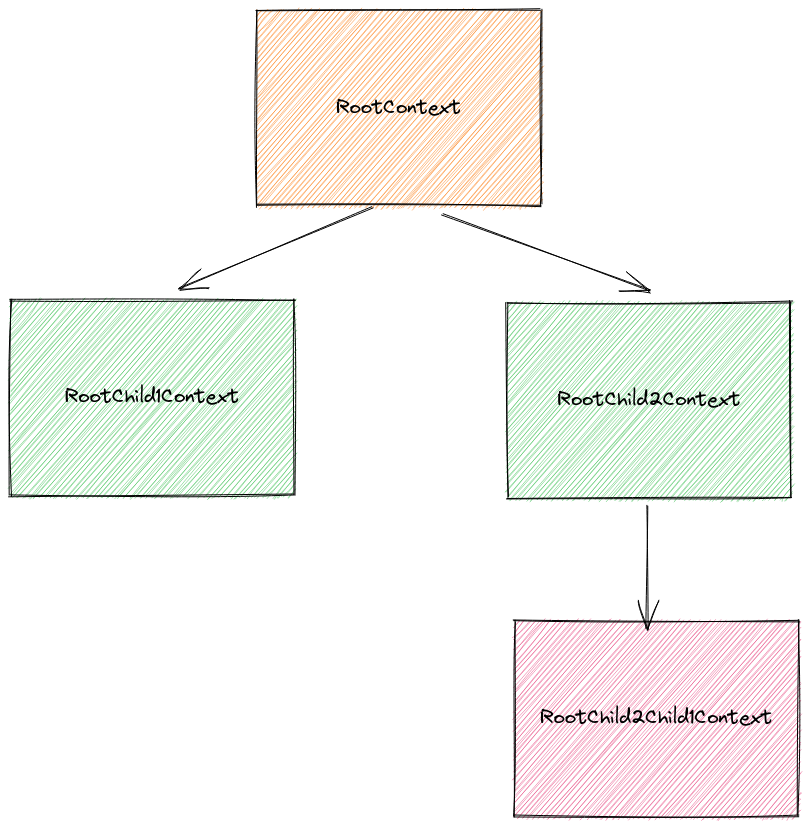

# Context relationships

Contexts can be hierarchical. Sometimes this makes sense when you want to
create isolated modules.

Your task is to create the following hierarchy

- `RootContext` should declare register the following beans
    - `CoreBeanOne`
    - `CoreBeanTwo`
- `RootChild1Context` should register
    - `RootChild1BeanOne`
    - `RootChild1BeanTwo`
- `RootChild2Context` should register
    - `RootChild2Bean`
- `RootChild2Child1Context` should register
    - `RootChild2Child1BeanOne`
    - `RootChild2Child1BeanTwo`

Show that:

- `RootContext` cannot access beans registered by any other context
- `RootChild1Context` and `RootChild2Context` can access beans registered by
  `RootContext`
- `RootChild2Context` cannot access `RootChild2Child1Context` beans
- `RootChild2Child1Context` can access `RootChild1Context` and `RootContext`
  beans

Finally, show that `RootChild1Context` cannot access beans registered by
`RootChild2Context`